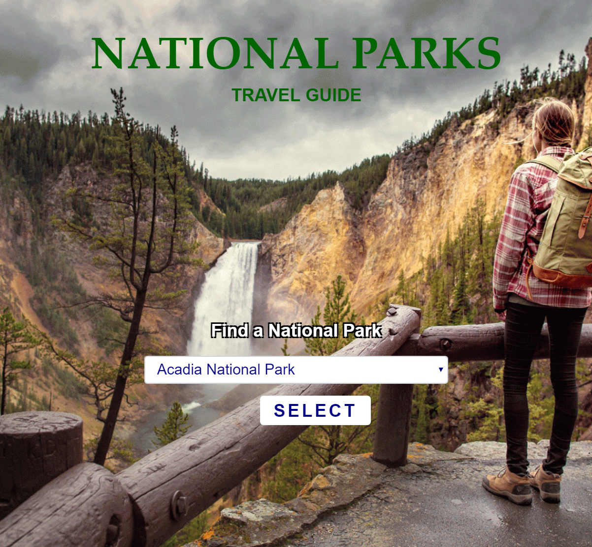

# National Parks Travel Guide

The National Parks Travel Guide is a website that allows users to gather information on a National Park.

https://watkins656.github.io/group-project-1/

## Getting Started

To get started, just choose a park from the list!

### Prerequisites

### Installing

## Running the tests

### Break down into end to end tests

### And coding style tests

## Deployment

## Built With

* [jQuery](http://jquery.com/) - The javaScript library used
* [NPS](https://www.nps.gov/subjects/digital/nps-data-api.htm) - National Parks Service API
* [OpenWeather](https://openweathermap.org/api) - Open Weather API
* [FireBase](https://firebase.google.com/) - Firebase Database Service

## Contributing

Please read [CONTRIBUTING.md](link) for details on our code of conduct, and the process for submitting pull requests to us.

## Versioning

We use [GitHub](www.github.com) for versioning. For the versions available, see the [tags on this repository](https://github.com/your/project/tags). 

## Authors

* **Reed Kroh** - *Front-End and Styling* - [reedkroh](https://github.com/reedkroh)
* **Joe McKinney** - *Front-End and Javascript* - [josephfmck](https://github.com/josephfmck)
* **Dustin Watkins** - *Javascript* - [watkins656](https://github.com/watkins656)

## License

## Acknowledgments

* Special Thanks to KU Coding Bootcamp Professors Ryan LaRue and Byron Ferguson
* Special Thanks to KU Coding Bootcamp TA's Chris Lynam and Kelsey Gasser 
